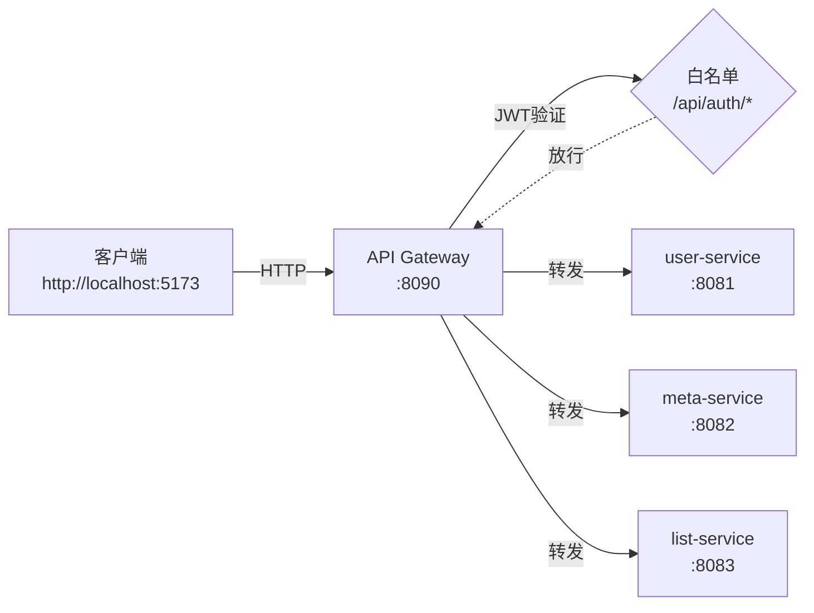

# gateway-service（统一网关）


## 项目结构图：




## 目标
将当前音乐网站项目的微服务调用链演进为：

`客户端 -> gateway-service(8090) -> user-service(8081) / meta-service(8082) / list-service(8083)`

约束：
- 所有外部请求必须经过 Gateway
- Gateway 负责统一 JWT 认证
- JWT 认证通过后，Gateway 将用户信息写入请求头并转发给后端服务
- 后端服务不再验证 JWT，只从请求头获取用户信息
- `POST /api/auth/register`、`POST /api/auth/login` 两个接口在网关放行

## 端口
- gateway-service：`8090`
- user-service：`8081`
- meta-service：`8082`
- list-service：`8083`

## 项目结构

根目录：`Music-Microservices/gateway-service/`

```text
gateway-service
├─ pom.xml
└─ src
   ├─ main
   │  ├─ java/com/zjsu/lyy/gateway_service
   │  │  ├─ GatewayServiceApplication.java
   │  │  ├─ config
   │  │  │  └─ CorsConfig.java
   │  │  └─ security
   │  │     └─ JwtAuthGlobalFilter.java
   │  └─ resources
   │     └─ application.yml
   └─ test
      └─ java/com/zjsu/lyy/gateway_service
         └─ GatewayServiceApplicationTests.java
```

## 认证方案（JWT）

### Token 由谁签发
- `user-service` 在登录/注册成功时签发 JWT（HS256）

### Gateway 校验规则
- 默认对所有路径启用 JWT 校验
- 放行路径：
  - `POST /api/auth/register`
  - `POST /api/auth/login`
- 校验入口：
  - Header：`Authorization: Bearer <token>`
- 校验成功后注入请求头（转发给后端服务）：
  - `X-Username`：用户名（JWT subject）
  - `X-User-Id`：用户 id（claim `uid`）
  - `X-User-Email`：邮箱（claim `email`）
  - `X-User-Is-Admin`：是否管理员（claim `admin`）

对应实现：
- `gateway-service/src/main/java/com/zjsu/lyy/gateway_service/security/JwtAuthGlobalFilter.java`

### JWT 配置
`gateway-service/src/main/resources/application.yml`：
- `security.jwt.secret`
- `security.jwt.issuer`

注意：`user-service` 与 `gateway-service` 必须保持同一套 `secret/issuer`，否则网关无法验证由 `user-service` 签发的 JWT。

## 路由转发规则
配置文件：`gateway-service/src/main/resources/application.yml`

| 外部路径前缀 | 转发到 |
| --- | --- |
| `/api/auth/**` | `http://localhost:8081` |
| `/api/users/**` | `http://localhost:8081` |
| `/api/meta/**` | `http://localhost:8082` |
| `/api/favorites/**` | `http://localhost:8083` |
| `/api/playlists/**` | `http://localhost:8083` |
| `/api/playlist-details/**` | `http://localhost:8083` |

## 后端服务对“用户信息”的获取方式

目前按你的要求已将 `list-service` 改为从请求头拿用户名，不再从 body/query 传入：
- Header：`X-Username`

典型例子：
- `POST /api/favorites`：`username` 不再在 body 里传，服务端从 `X-Username` 读取
- `GET /api/favorites/username`：不再需要 query 参数 `username`，服务端从 `X-Username` 读取

实现位置：
- `list-service/src/main/java/com/zjsu/lyy/list_service/controller/*`
- `list-service/src/main/java/com/zjsu/lyy/list_service/service/*`
- `list-service/src/main/java/com/zjsu/lyy/list_service/dto/Create*Request.java`

## API 一览（网关入口视角）

### 1) 认证（放行）
服务：user-service（通过 gateway 转发）

#### 注册
- `POST http://localhost:8090/api/auth/register`
- Body：
```json
{
  "username": "tom",
  "email": "tom@example.com",
  "password": "123456"
}
```
- 返回：`201`
```json
{
  "token": "eyJhbGciOiJIUzI1NiJ9...",
  "user": { "id": 1, "username": "tom", "email": "tom@example.com", "isAdmin": false }
}
```

#### 登录
- `POST http://localhost:8090/api/auth/login`
- Body：
```json
{
  "username": "tom",
  "password": "123456"
}
```
- 返回：`200`，同上结构

### 2) 需要 JWT 的业务接口（示例）
以下接口均需要：
- `Authorization: Bearer <token>`

#### 查询我的收藏
- `GET http://localhost:8090/api/favorites/username`

#### 新增收藏
- `POST http://localhost:8090/api/favorites`
- Body：
```json
{
  "songName": "Shape of You"
}
```

## 构建与运行

### 1) 构建（单模块）
在各自目录执行：
- `.\mvnw test`

### 2) 本地启动顺序（推荐）
分别打开 4 个终端：
- `user-service`：`.\mvnw spring-boot:run`
- `meta-service`：`.\mvnw spring-boot:run`
- `list-service`：`.\mvnw spring-boot:run`
- `gateway-service`：`.\mvnw spring-boot:run`

启动后访问：
- 网关：`http://localhost:8090`

## 如何测试（curl 示例）

### 1) 注册拿 token
```bash
curl -X POST http://localhost:8090/api/auth/register ^
  -H "Content-Type: application/json" ^
  -d "{\"username\":\"tom\",\"email\":\"tom@example.com\",\"password\":\"123456\"}"
```

### 2) 带 token 调用 list-service（经网关）
```bash
curl http://localhost:8090/api/favorites/username ^
  -H "Authorization: Bearer <TOKEN>"
```

### 3) 未带 token 的效果
```bash
curl http://localhost:8090/api/favorites/username
```
应返回 `401`。

